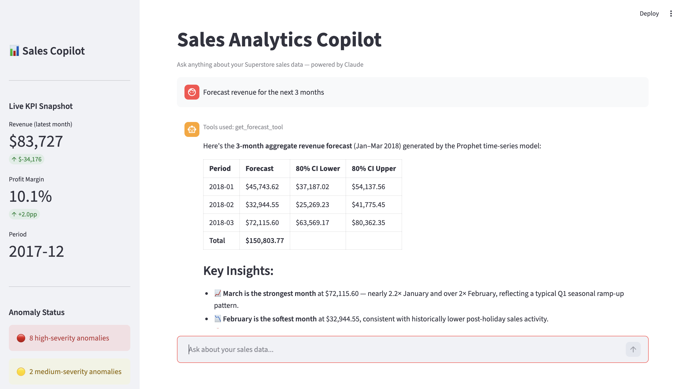
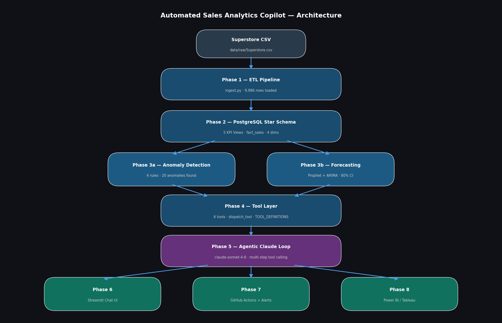

# Automated Sales Analytics Copilot

> An end-to-end agentic analytics system that ingests multi-source sales data, computes KPIs, detects business anomalies, answers natural language questions via text-to-SQL, models what-if scenarios, and delivers automated alerts 

Built by **Santhosh Narayanan Baburaman** | USC MS Analytics | Targeting Data Analyst / Business Analyst roles

[](https://python.org)
[](https://postgresql.org)
[](https://streamlit.io)

---

## What It Does

Ask it anything about your sales data in plain English:

> *"Why did profit drop in Q3 2016?"*
> *"Which regions are underperforming and by how much?"*
> *"What happens to margin if we reduce discounts to 15%?"*
> *"Forecast revenue for the next 3 months."*

The copilot reasons over a live PostgreSQL database using 6 structured tools, detects anomalies automatically every night, and surfaces the answers as charts and natural language in a Streamlit chat UI.

---

## App Preview



---

## Architecture



---

## Key Features

### Anomaly Detection (4 Rules)
Runs automatically every night against the KPI views. Each anomaly outputs `flag`, `severity`, `segment`, `delta`, and `period`.

| Rule | Trigger |
|------|---------|
| **Margin Compression** | Revenue up >2% MoM but profit down >1% MoM |
| **Discount Erosion** | Category avg discount exceeds threshold (default 25%) |
| **Regional Outlier** | Region margin >2σ below the period mean |
| **Growth Reversal** | Positive MoM growth flips negative for 2+ consecutive periods |

### Forecasting
Prophet and ARIMA models trained on monthly KPI data. Returns point forecasts with 80% confidence intervals by metric (revenue/profit) and optional segment (category or region).

### 6 Structured Tools
Claude calls these tools during reasoning — they are the only data access layer:

| Tool | Purpose |
|------|---------|
| `get_kpis` | Monthly / category / regional KPI summaries |
| `detect_anomalies_tool` | Run all 4 anomaly rules, return flagged results |
| `drill_down` | Granular slice of fact_sales by category + region + period |
| `get_forecast_tool` | Prophet forecast with confidence interval |
| `run_scenario` | What-if analysis (discount rate or revenue growth) |
| `generate_sql` | Natural language → SQL → executed result |

### What-If Scenario Engine
Simulate business decisions against the last 12 months of KPIs — no DB writes, pure Pandas. Supports discount rate changes and revenue growth scenarios, returning actuals vs scenario KPIs and net delta.

---

## Tech Stack

| Layer | Tools |
|-------|-------|
| Language | Python 3.11+, SQL |
| Database | PostgreSQL — star schema + 5 KPI views |
| ETL | Pandas, SQLAlchemy, PyYAML |
| Analytics | Pandas, NumPy, SciPy |
| Forecasting | Prophet, statsmodels (ARIMA) |
| AI Layer | Anthropic Claude API — `claude-sonnet-4-6`, tool use |
| UI | Streamlit (Streamlit Cloud deployable) |
| Dashboard | Power BI DirectQuery / Tableau Live |
| Alerting | Slack Webhooks (Block Kit), SMTP email |
| Automation | GitHub Actions (nightly cron) |

---

## Dataset

Superstore sales dataset — 9,986 orders, ~$2.3M revenue, 4 years (2014–2017).
Categories: Furniture / Office Supplies / Technology across 4 US regions.

Key insight baked into the data: **discounts above 30% drive significant losses — especially in Furniture** (avg margin drops to -22% in the 30–50% discount band).

---

## Project Structure

```
sales-analytics-copilot/
├── config/
│   └── sources.yaml              # Column mapping + validation thresholds
├── data/
│   └── raw/                      # Raw CSV files
├── sql/
│   └── 01_schema.sql             # Star schema + 5 KPI views
├── src/
│   ├── pipeline/
│   │   └── ingest.py             # Phase 1: ETL + validation
│   ├── analytics/
│   │   ├── anomalies.py          # Phase 3: 4-rule anomaly detection
│   │   └── forecast.py           # Phase 3: Prophet + ARIMA forecasting
│   ├── tools/
│   │   └── tool_layer.py         # Phase 4: 6 tools + dispatcher
│   ├── agent/
│   │   └── copilot.py            # Phase 5: Agentic Claude loop
│   └── app/
│       └── streamlit_app.py      # Phase 6: Streamlit chat UI
├── .github/
│   └── workflows/
│       └── nightly.yml           # Phase 7: Nightly pipeline + alerts
├── .env.example                  # Environment variable template
├── requirements.txt
└── README.md
```

---

## Setup

### 1. Clone and install dependencies
```bash
git clone https://github.com/Santhosh-1917/sales-analytics-copilot
cd sales-analytics-copilot
pip install -r requirements.txt
pip install prophet   # install separately due to build deps
```

### 2. Configure environment
```bash
cp .env.example .env
```
Edit `.env` with your credentials:
```
DB_HOST=localhost
DB_PORT=5432
DB_NAME=sales_copilot
DB_USER=your_pg_user
DB_PASSWORD=your_pg_password
ANTHROPIC_API_KEY=sk-ant-...        # required for Phase 5+
SLACK_WEBHOOK_URL=...               # optional — anomaly alerts
ALERT_EMAIL_FROM=...                # optional — email alerts
ALERT_EMAIL_TO=...
ALERT_EMAIL_PASSWORD=...
```

### 3. Create the database and schema
```bash
createdb sales_copilot
psql -U your_pg_user -d sales_copilot -f sql/01_schema.sql
```

### 4. Place your data file
Put `Superstore.csv` in `data/raw/`. Column mapping is configured in `config/sources.yaml`.

### 5. Run the ingestion pipeline
```bash
python -m src.pipeline.ingest
```

### 6. Run smoke tests per phase
```bash
python -m src.analytics.anomalies     # prints detected anomalies as JSON
python -m src.analytics.forecast      # prints 3-month forecast
python -m src.tools.tool_layer        # calls all 6 tools and prints results
python -m src.agent.copilot           # interactive CLI chat
streamlit run src/app/streamlit_app.py
```

---

## Build Status

| Phase | Description | Status |
|-------|-------------|--------|
| 1 | Multi-source ingestion + validation → PostgreSQL | ✅ Complete |
| 2 | Star schema + 5 KPI SQL views | ✅ Complete |
| 3 | Anomaly detection (4 rules) + Prophet/ARIMA forecasting | ✅ Complete |
| 4 | Structured tool layer (6 tools + dispatcher) | ✅ Complete |
| 5 | Agentic Claude reasoning loop | 🔲 Next |
| 6 | Streamlit chat UI | 🔲 Planned |
| 7 | GitHub Actions nightly pipeline + Slack/email alerts | 🔲 Planned |
| 8 | Power BI / Tableau live dashboard integration | 🔲 Planned |

---

## Database Schema

**Fact table:** `fact_sales` — order_id, order_date, ship_date, ship_mode, product_key, region_key, customer_key, revenue, quantity, discount_pct, profit, margin_pct

**Dimensions:** `dim_date`, `dim_product`, `dim_region`, `dim_customer`

**KPI Views:**
- `v_monthly_kpis` — period, order_count, revenue, profit, margin_pct, avg_discount_pct
- `v_category_performance` — breakdown by category + sub_category
- `v_regional_performance` — breakdown by region + state with profit_rank
- `v_discount_impact` — revenue/profit by discount band (0%, 1–10%, 11–20%, etc.)
- `v_growth_rates` — MoM revenue and profit growth percentages

---

*Santhosh Narayanan Baburaman | USC MS Analytics | [LinkedIn](https://linkedin.com/in/santhosh-narayanan-7b9466249)*
